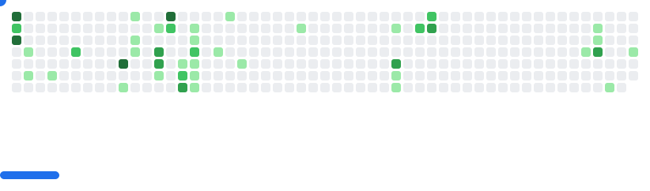

# Michael 

Java Backend Developer | Data Analysis

## Education

- **Feb 2025 – Present**  
  *Federal Institute of Education, Science and Technology of São Paulo*  
  Technologist Degree in Software Analysis and Development (ADS)

- **Aug 2023 – Dec 2024**  
  *SENAI-SP (National Service for Industrial Training – São Paulo)*  
  Technical Degree in Systems Development

## Stack

### Backend
<code></code>
<code></code>

> Worked with Laravel and Node.js in academic projects.

### Data
<code></code>
<code></code>
<code></code>

### Tools
<code></code>
<code></code>
<code></code>
<code></code>

###
<picture>
  <source
    media="(prefers-color-scheme: dark)"
    srcset="images/breakout-dark.svg"
  />
  <source
    media="(prefers-color-scheme: light)"
    srcset="images/breakout-light.svg"
  />
  
</picture>
